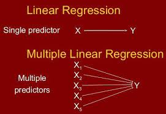

# Model Development

## Menu

- [Model Development](#model-development)
  - [Menu](#menu)
  - [Summary](#summary)
  - [Learning Objectives](#learning-objectives)
  - [Model Development](#model-development-1)
  - [Simple & Multiple Linear Regression](#simple--multiple-linear-regression)
    - [SLR: Simple Linear Regression](#slr-simple-linear-regression)
  - [Model Evaluation using Visualization](#model-evaluation-using-visualization)
    - [Regression plots](#regression-plots)
    - [Residual plots](#residual-plots)
    - [Distribution plots](#distribution-plots)
  - [Polynomial Regression and Pipelines](#polynomial-regression-and-pipelines)
  - [Measures for In-Sample Evaluation](#measures-for-in-sample-evaluation)
  - [Prediction and Decision Making](#prediction-and-decision-making)

## Summary
We are looking for answer of the following question:

>> How can we determine a fair value for a used car?

## Learning Objectives
- Simple and Multiple Linear Regression
- Model Evaluation using Visualization 
- Polynomial Regression and Pipelines
- R-squared and MSE for In-Sample Evaluation 
- Prediction and Decision Making

## Model Development
- A model or estimator can be thought of as a mathematical equation used to predict a
value given one or more other values.  
- Relating one or more independent variables or features to dependent variables.

## Simple & Multiple Linear Regression

Linear Regression will refer to one independent variable to make a prediction. In the other hand, Multiple Linear Regression will refer to multiple independent variables to make a prediction.

### SLR: Simple Linear Regression
1. The predictor (independent) variable - __x__ 
2. The target (dependent) variable - __y__

y = b0 + b1x

b0: the intercept  
b1: the slope

## Model Evaluation using Visualization 

### Regression plots
Regression plots are a good estimate of: The relationship between two variables:
1. The strength of the correlation, and
2. The direction of the relationship (positive or negative).

### Residual plots

### Distribution plots

## Polynomial Regression and Pipelines
- Polynomial
- Regression
- curvilinear relationship?
- predictor variables
- quadratic
- second order Polynomial Regression
- third order Polynomial Regression
- cubic
- Pipelines:
  - Normalization -> Polynomial Transform -> Linear Regression

## Measures for In-Sample Evaluation
- A way to numerically determine how good the model fits on our data.
- 2 important measures that we often use to determine the fit of a model are: 
  1. Mean Square Error (MSE)
  2. R-squared.

## Prediction and Decision Making